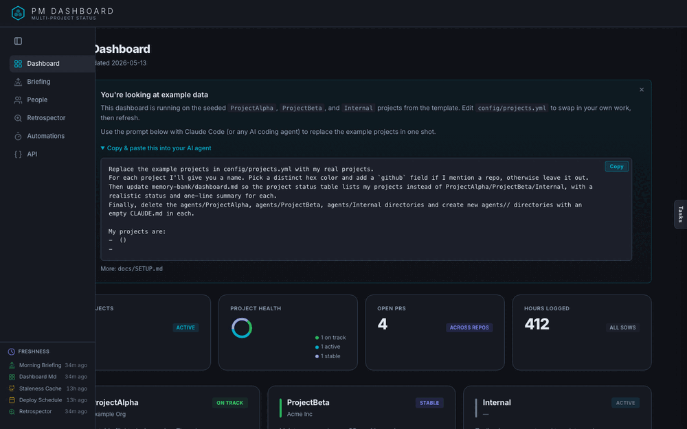

# LSM Hivemind Dashboard Template

A starting point for PMs who want a single web dashboard that summarizes status
across multiple client projects. The dashboard reads plain markdown and JSON
files your agents (or you) produce, then renders project status, morning
briefings, team activity, stuck PRs, and a self-improvement retrospector.



This is a **template repo**, not a turnkey product. Fork it, edit
`config/projects.yml`, point your own agents at the file layout, and shape it
to your workflow. Most PMs will not have the same upstream integrations, so
the goal is parity in *structure*, not feature-for-feature parity.

## What you get out of the box

- A Starlette web app at `dashboard/` with pages for projects, briefings, team activity, retrospector, automations, and a knowledge-base memory map.
- One project list (`config/projects.yml`) with `status`, `category`, and `kenkeep_tag` fields. The dashboard reads it, and any automation scripts you add should read the same file, so archiving a project is a one-line change.
- A structured sidecar (`memory-bank/dashboard.json`). When it is present and valid, the dashboard uses it instead of parsing `dashboard.md` prose.
- Crash-safe writes (`dashboard/storage.py`) for every file the dashboard saves: temp file, fsync, rename, plus a per-file lock around read-modify-write.
- A `/memory-map` page that renders a [kenkeep](https://github.com/e0ipso/kenkeep) knowledge base as a 2D/3D graph. See `docs/KENKEEP.md`.
- Example seed data so every page renders something on first boot.

## What it does **not** ship with

- No real data fetchers. The originals (Noko, GitHub PR staleness, deploy schedules, Jira) are removed. You bring your own scripts that drop files in the paths the dashboard reads. See `docs/INTEGRATIONS.md`.
- No retrospector pipeline. The `/retrospector` page renders `memory-bank/retrospector-report.md` and its JSON sibling in the shape shown by the example files in `memory-bank/`; producing that report from your session logs is up to you.
- No bespoke client integrations.

## Quick start

```bash
git clone <your-fork-url> my-dashboard
cd my-dashboard/dashboard
python3 -m venv .venv
.venv/bin/pip install -r requirements.txt
.venv/bin/uvicorn app:app --reload --host 127.0.0.1 --port 8080
```

Open <http://127.0.0.1:8080>. You should see the example projects.

Then edit `config/projects.yml` and `config/dashboard.yml` to describe your
own projects.

## Next steps

- `docs/SETUP.md` — full configuration walkthrough.
- `docs/INTEGRATIONS.md` — how to wire up Noko, GitHub, or your own data sources, and the `dashboard.json` sidecar shape.
- `docs/KENKEEP.md` — adding a kenkeep knowledge base and the memory map.

## License

MIT. See `LICENSE`.
